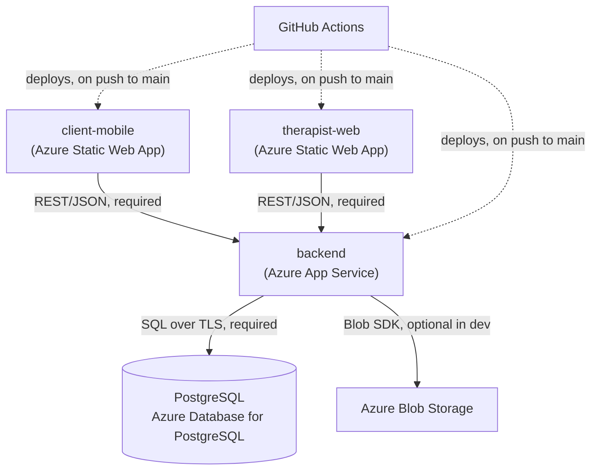

# Production Support & Testing Scenarios

## Service Dependency Diagram



**Hard dependency:** if PostgreSQL is unreachable, the backend returns 500s on
nearly every endpoint — both frontends become unusable (they have no offline/cached
mode). This is the single point of failure in the system.

**Soft dependency:** if Blob Storage is unreachable in production, existing
video/photo URLs still resolve (they're static links), but new uploads (exercise
library videos, submission proof) fail. In local dev this dependency doesn't exist
at all — media falls back to local disk.

## Monitoring

There is **no dedicated monitoring/alerting solution configured yet**
(Application Insights is listed as a next step — see Status & Roadmap). Current
visibility is manual:

| What | Where | How to check |
|---|---|---|
| Backend logs | Azure Portal → App Services → `api-mtp2026` → **Log stream** | Live tail of stdout/stderr from the running app |
| Backend health | `GET https://api-mtp2026.azurewebsites.net/v1/health` (if implemented) or `GET /docs` | 200 + Swagger UI loads = app is up and can import cleanly |
| Frontend deploy status | GitHub → repo → **Actions** tab → filter by workflow name | Green check = last deploy succeeded; does **not** guarantee the build reflects the latest source (see Incident 2 below) |
| Frontend runtime errors | Browser DevTools console on the live site | No server-side error aggregation exists |
| Database | Azure Portal → the Postgres server resource → **Monitoring** tab | Connection count, CPU, storage |

**Known gap:** because no migration step is wired into CI/CD, there is no automated
signal that a deploy shipped code expecting a database column that doesn't exist
yet in production. This has to be caught manually (see Incident 4).

## Common Incidents & Recovery Steps

### 1. Database connection loss / timeout from a local machine

**Symptom:** `psycopg2.OperationalError: connection to server ... failed:
Connection timed out`, when running Alembic or the backend locally against the
production database.

**Cause:** Azure Database for PostgreSQL blocks all connections by default except
from allowlisted IP addresses. The Azure App Service backend is allowlisted
separately from any individual developer's machine.

**Recovery:**
1. Azure Portal → the Postgres server resource (e.g. `pg-mtp2026b`) → **Networking**
2. Add the connecting machine's current public IP (Portal usually offers an
   "Add current client IP address" shortcut)
3. Save, wait ~1-2 minutes for propagation, retry

This is not a credentials problem — a bad password produces a different error
(`password authentication failed`), not a timeout.

### 2. Deployed frontend serving stale content despite a "successful" CI run

**Symptom:** GitHub Actions shows the deploy workflow green, but the live site
doesn't reflect the latest code changes.

**Cause (observed in this project):** the therapist-web app had a TypeScript type
error in a shared UI component. `next build` was silently failing at the
type-check step, and Azure's Oryx build pipeline was falling back to serving a
previously-cached successful build rather than failing the whole GitHub Action —
so CI reported "success" (in a suspiciously short duration) while shipping nothing
new.

**Diagnosis technique:** don't trust "deploy succeeded" alone. Fetch the live
page's actual served JS chunks and grep them for a string unique to the change you
just shipped:
```
curl -s https://<site>/clients -o page.html
grep -o '/_next/static/chunks/[a-zA-Z0-9_./\-]*\.js' page.html   # include the slash — nested app/ paths need it
# download each chunk, grep for your new code's marker text
```
If the marker isn't found anywhere, the deploy didn't actually pick up your change.

**Recovery:** run `npm run build` locally first and read the full output — a real
type error will surface clearly ("Failed to type check"). Fix it, confirm a clean
local build (exit code 0), then push. Real builds take noticeably longer than the
stale/cached ones (~4 minutes vs. ~1 minute) — that duration difference is itself
a useful signal.

### 3. Backend 500s / app won't start after deploy

**Symptom:** `api-mtp2026.azurewebsites.net` returns 500s or times out after a
deploy.

**Recovery:**
1. Check Log stream (see Monitoring table) for a Python traceback — most commonly
   a missing environment variable or an import error from a new dependency not in
   `requirements.txt`.
2. Azure Portal → App Services → `api-mtp2026` → **Restart** (safe, no data loss —
   the app is stateless; all state lives in PostgreSQL/Blob Storage).
3. If the traceback points to the database (e.g. `UndefinedColumn`), see Incident 4.

### 4. Backend deployed code expects a database column that doesn't exist yet

**Symptom:** Endpoints touching a recently-changed model return 500 with a
SQLAlchemy/`psycopg2.errors.UndefinedColumn` error, immediately after a backend
deploy that included a model change.

**Cause:** none of the three deploy workflows run `alembic upgrade head`
automatically (see Architecture Diagram). Deploying new code that references a new
column does not add that column to production.

**Recovery:** run the migration manually against production —
```
cd apps/backend
$env:DATABASE_URL="<production connection string, from Azure Portal App Settings>"
.\venv\Scripts\alembic.exe upgrade head
```
Verify directly rather than trusting silent success:
```python
# check current revision matches the migration you expect, and the column exists
SELECT version_num FROM alembic_version;
SELECT column_name FROM information_schema.columns WHERE table_name='<table>' AND column_name='<new_column>';
```
Close the terminal afterward so the production `DATABASE_URL` override doesn't
persist into an unrelated later command in that shell.

---

## Testing Scenarios & Results

### Unit / integration tests

**Current state: no automated test suite exists** in this repository — this is a
known gap, not an oversight being hidden. All verification below is manual/scripted
ad hoc rather than a checked-in `pytest`/Jest suite. Recommended next step: add
`pytest` coverage for `app/scheduling.py` (pure functions, easy to unit test — e.g.
`compute_due_status`, `days_until_available`) and FastAPI's `TestClient` for
endpoint-level integration tests.

### Manual test cases (expected vs. actual)

| # | Test | Endpoint | Expected | Actual | Result |
|---|---|---|---|---|---|
| M-01 | List clients | `GET /v1/clients?therapist_id=therapist-1` | 200, array of active/inactive clients with computed `completed_this_week` | 200, 5 clients returned, counts computed from real submissions (not the stale seeded column) | ✅ PASS |
| M-02 | Log a clinic session | `POST /v1/clients/{id}/sessions` with `count=3` | 201, creates 3 `ClinicSession` rows, counts toward the same weekly target the client's app shows | 201, verified `weekly_count` incremented by 3 on next `GET /v1/programs/{id}` | ✅ PASS |
| M-03 | Submit exercise while still resting (spacing rule) | `POST /v1/mobile/me/submit` for an exercise with `min_days_between` unexpired | Expected: 409 rejection | Before fix: 201, silently accepted (client-side-only enforcement). After fix: 409 with a clear message | ✅ PASS (after fix — see Issue Diagnosis) |
| M-04 | Due-status pacing | `GET /v1/programs/{client_id}` for an exercise at 1/5 completed on a Thursday | Expected: `on_track` (4 opportunities remain — today + 3 days — for 4 remaining reps) | Before fix: `past_due` (compared against an even 1/7-per-day pace instead of true reachability). After fix: `on_track` | ✅ PASS (after fix — see Issue Diagnosis) |
| M-05 | Reuse a client-recorded library video for a different client | "Add from library" in Assign/Edit Program drawers, for a template with `recorded_for_client_id` set to a different client | Expected: hidden from the picker entirely | Confirmed excluded from `libraryByCategory` for any client_id other than the recorded one | ✅ PASS |

### Post-deployment smoke tests

Run these after every deploy, in order:

1. **Backend reachable:** `curl -s -o /dev/null -w "%{http_code}" https://api-mtp2026.azurewebsites.net/v1/clients?therapist_id=therapist-1` → expect `200`
2. **Frontend loads real data:** open the deployed therapist-web URL → `/clients` → confirm actual client names render, not an empty/error state (empty state usually means it's pointed at the wrong backend or CORS is misconfigured)
3. **Auth/session round trip:** log into client-mobile with a seeded access code (`EMMA-2201`) → confirm today's exercises load
4. **Write path:** submit one exercise from client-mobile → refresh the therapist-web Submissions queue → confirm it appears within a few seconds
5. **Bundle freshness (frontend only, after a code change):** grep the live deployed JS chunks for a string unique to the change just shipped (see Incident 2's diagnosis technique) — don't rely on CI's green checkmark alone
