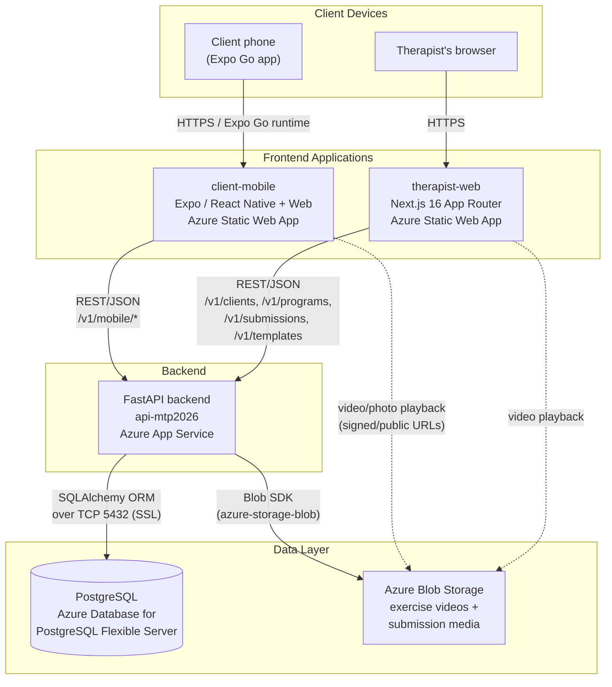
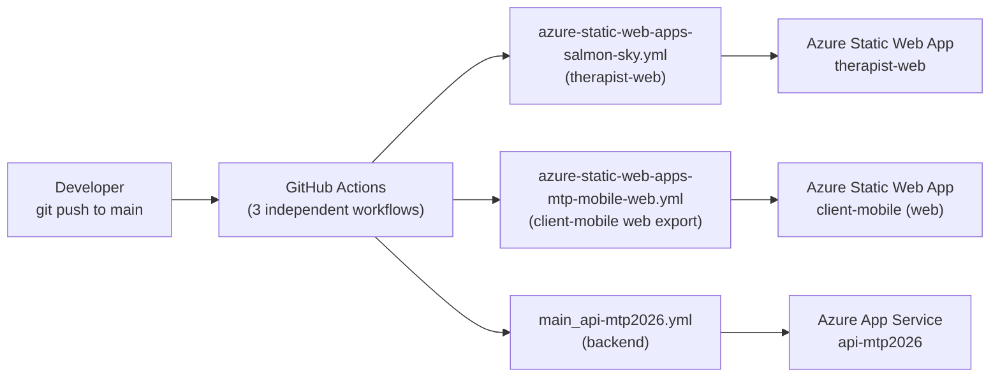

# Architecture Diagram

## System Overview

MyTherapyPath is a monorepo of three independently deployed applications sharing a
single FastAPI backend and PostgreSQL database:

| Component | Role | Technology | Hosting |
|---|---|---|---|
| **client-mobile** | Client-facing app: view assigned exercises, submit proof, track progress | Expo / React Native (+ web export) | Local: Expo dev server. Production: Azure Static Web Apps (web export) |
| **therapist-web** | Therapist dashboard: manage clients, assign programs, review submissions | Next.js 16 (App Router) | Azure Static Web Apps |
| **backend** | Shared REST API for both frontends | FastAPI + SQLAlchemy + Alembic | Azure App Service (Linux) |
| **PostgreSQL** | Primary datastore | PostgreSQL (Azure Database for PostgreSQL Flexible Server) | Azure |
| **Blob Storage** | Exercise videos and submission photo/video proof | Azure Blob Storage | Azure (falls back to local disk under `apps/backend/uploads/` in dev) |

There is currently **no staging environment** — both frontends and the backend deploy
directly to production on every push to `main`. This is a known gap, tracked in the
Status & Roadmap section of the project.

## Component Diagram

## Deployment / CI-CD Flow

**Important operational note:** none of the three workflows run database migrations
automatically. A schema change requires a developer to run `alembic upgrade head`
manually against the production `DATABASE_URL` after the backend deploy completes —
see [System Setup Instructions](02-system-setup.md) and the "Database connection /
schema drift" entry in [Production Support](01-production-support.md).

## Environments

| Environment | Frontend URLs | Backend URL | Database |
|---|---|---|---|
| **Local development** | `http://localhost:3000` (therapist-web), Expo dev server (client-mobile) | `http://localhost:8000` | Local PostgreSQL instance |
| **Production** | `https://salmon-sky-01426550f.7.azurestaticapps.net` (therapist-web), `https://zealous-mud-04996bd0f.7.azurestaticapps.net` (client-mobile web) | `https://api-mtp2026.azurewebsites.net` | Azure Database for PostgreSQL (`pg-mtp2026b`) |
| **Staging** | Not implemented — planned (see Status & Roadmap) | — | — |

Both local and production frontends can be pointed at either backend via the
`NEXT_PUBLIC_API_URL` (therapist-web) and `apiBase` in `app.json` (client-mobile)
configuration values — see System Setup for details.

## Communication Flows Summary

1. **Client submits exercise proof:** Client phone → `client-mobile` (Expo) → `POST /v1/mobile/me/submit` → FastAPI validates + persists to Blob Storage → writes `Submission` row to PostgreSQL.
2. **Therapist reviews submissions:** Browser → `therapist-web` → `GET /v1/submissions` → FastAPI reads PostgreSQL → therapist approves/rejects → `PATCH /v1/submissions/{id}/approve|reject`.
3. **Therapist assigns a program:** Browser → `therapist-web` → `POST /v1/programs` (full replace) or `PATCH /v1/programs/exercises/{id}` (single-exercise frequency/spacing edit) → FastAPI writes `Program`/`ProgramExercise` rows.
4. **In-session logging (no client device needed):** Browser → `therapist-web` → `POST /v1/clients/{id}/sessions` → FastAPI writes `ClinicSession` row(s), counted toward the same weekly target the client's app displays.
